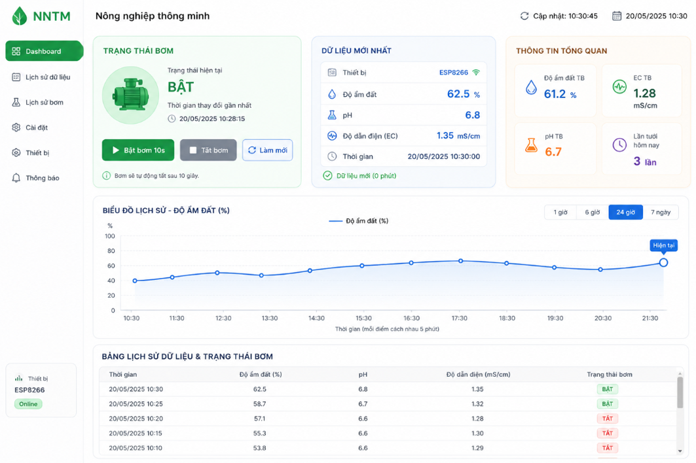

# Soil Monitoring & Pump Control System

**Dự án này là hệ thống giám sát đất và điều khiển bơm tự động**, bao gồm:

- Backend Python + FastAPI (`app/main.py`)
- Frontend React + Vite (`frontend/`)
- Firmware Arduino + ESP8266 trong `firmware/`
- Cơ sở dữ liệu MongoDB để lưu dữ liệu cảm biến và trạng thái bơm

---

## �️ Giao diện & ảnh minh họa

Dự án có thể hiển thị dashboard giám sát đất như hình, với:

- trạng thái bơm hiện tại,
- dữ liệu mới nhất của cảm biến,
- bảng lịch sử dữ liệu và trạng thái bơm,
- biểu đồ lịch sử độ ẩm đất.

**Gợi ý thêm ảnh vào README:**

1. Tạo thư mục `doc/` ở gốc dự án.
2. Lưu ảnh giao diện dashboard với tên `doc/dashboard.png`.
3. Chèn vào README như sau:

```md

```

> Nếu bạn có ảnh giao diện thực tế, thêm vào `doc/dashboard.png` sẽ làm README sinh động hơn rất nhiều.

---

## �🚀 Mục tiêu

Hệ thống thu thập dữ liệu cảm biến từ thiết bị IoT, lưu trữ vào MongoDB và cung cấp dashboard web để:

- theo dõi độ ẩm đất, nhiệt độ, độ ẩm không khí và mức nước;
- hiển thị dữ liệu lịch sử dưới dạng biểu đồ;
- điều khiển bơm nước bằng tay từ giao diện web;
- ghi nhận lịch sử tưới và trạng thái bơm.

---

## 🧩 Công nghệ chính

- Backend: `Python`, `FastAPI`, `Motor`, `uvicorn`
- Frontend: `React`, `Vite`, `Chart.js`, `react-chartjs-2`
- Firmware: `Arduino` + `ESP8266`
- Database: `MongoDB`

---

## 📁 Cấu trúc thư mục

- `app/`
  - `main.py` : API server chính
- `frontend/`
  - `package.json` : cấu hình React / Vite
  - `src/` : mã nguồn giao diện
- `firmware/`
  - `arduino_sensor_reader/` : mã Arduino đọc cảm biến
  - `esp8266_controller/` : mã ESP8266 gửi dữ liệu và điều khiển relay
- `requirements.txt` : thư viện Python cần cài
- `README.md` : tài liệu dự án chính
- `Huongdanreadme.md` : tài liệu hướng dẫn phần cứng hiện có

---

## ⚙️ Các API chính

- `POST /api/sensor` : nhận dữ liệu cảm biến từ thiết bị
- `POST /api/pump` : gửi lệnh bật/tắt bơm bằng tay
- `GET /api/latest` : lấy dữ liệu mới nhất
- `GET /api/history` : lấy dữ liệu lịch sử cảm biến
- `GET /api/watering-history` : lấy lịch sử lệnh bơm
- `GET /api/pump/state` : lấy trạng thái bơm hiện tại

---

## 🧪 Chạy backend

1. Tạo virtual environment và kích hoạt:

```bash
python -m venv venv
venv\Scripts\activate
```

2. Cài đặt dependencies:

```bash
pip install -r requirements.txt
```

3. Chạy server FastAPI:

```bash
uvicorn app.main:app --reload --port 8000
```

4. Mở `http://localhost:8000/docs` để kiểm thử API.

---

## 🌐 Chạy frontend

1. Vào thư mục frontend:

```bash
cd frontend
```

2. Cài dependencies:

```bash
npm install
```

3. Chạy dev server:

```bash
npm run dev
```

4. Mở URL do Vite tạo ra (thường là `http://localhost:5173`).

---

## 🔌 Cấu hình MongoDB

Backend dùng biến môi trường:

- `MONGO_URI` : URL kết nối MongoDB
- `MONGO_DB_NAME` : tên database (mặc định `NNTM`)

Nếu không cài, backend sẽ dùng giá trị mặc định trong code.

---

## 🔧 Tính năng nổi bật

- Giám sát độ ẩm đất theo thời gian thực
- Hiển thị dữ liệu lịch sử dưới dạng biểu đồ
- Điều khiển bơm trực tiếp từ dashboard
- Lưu lại lịch sử tưới và trạng thái bơm
- Hỗ trợ nhiều thiết bị qua `device_id`

---

## 📌 Ghi chú

- Đảm bảo `frontend` có thể kết nối vào backend bằng `API_BASE` đúng địa chỉ.
- Nếu dùng firmware, cấu hình WiFi và URL API trong file `firmware/esp8266_controller/esp8266_controller.ino`.
- Dữ liệu từ cảm biến có thể bao gồm `soil_moisture`, `light`, `temperature`, `humidity`, `water_level`.

---

## 💡 Muốn tôi bổ sung gì nữa?

- Hướng dẫn cài đặt chi tiết cho firmware
- Mô tả chi tiết cấu trúc database
- Hướng dẫn deploy hoặc chạy Docker
